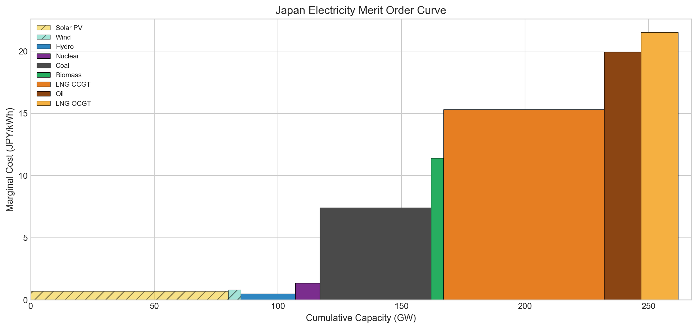
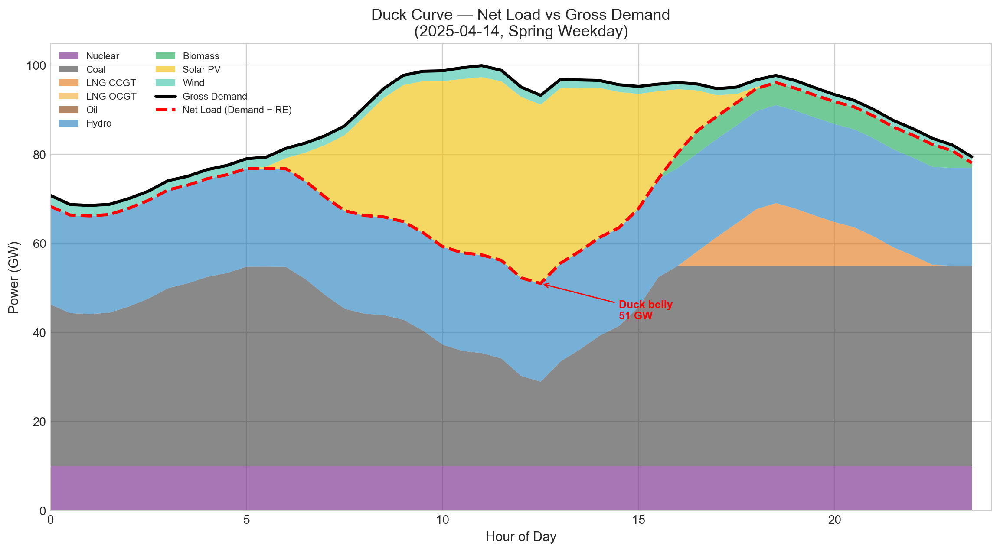
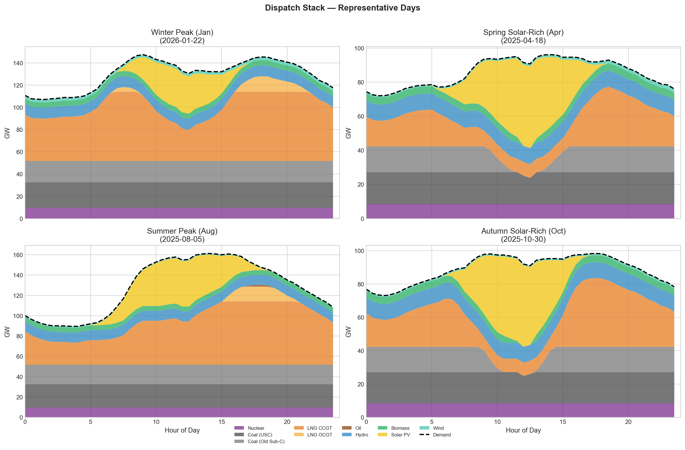
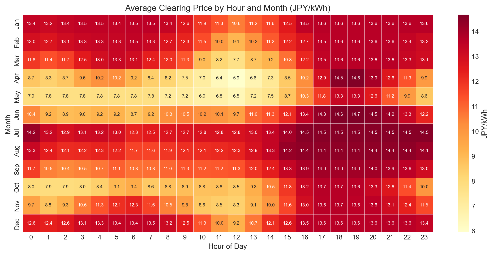
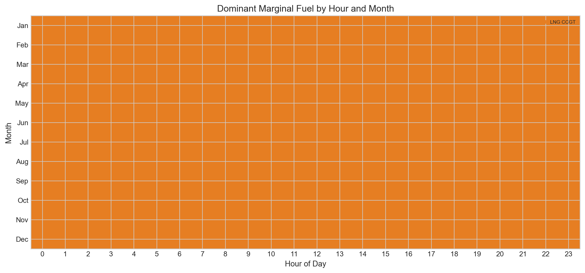
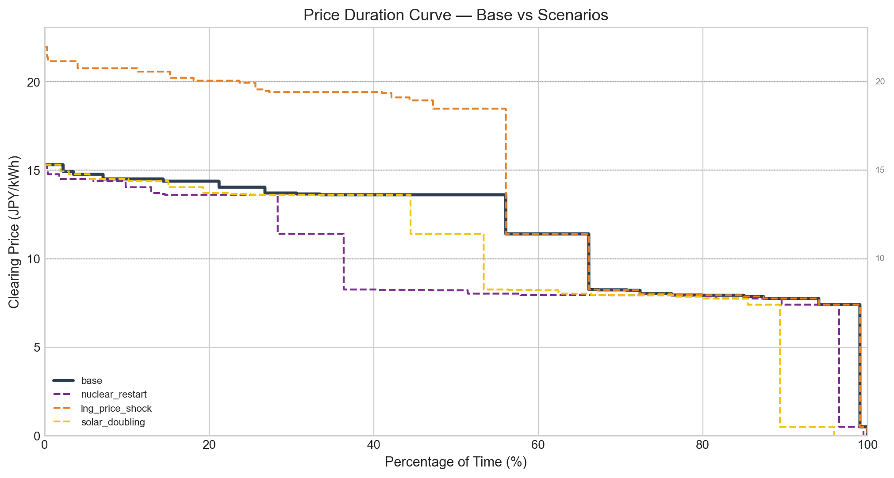
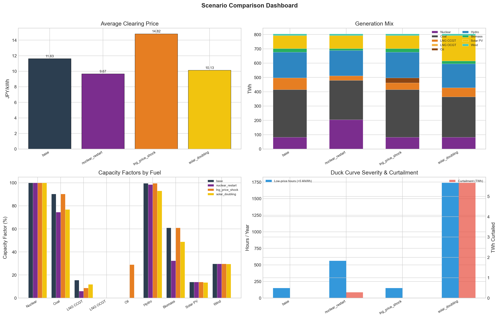
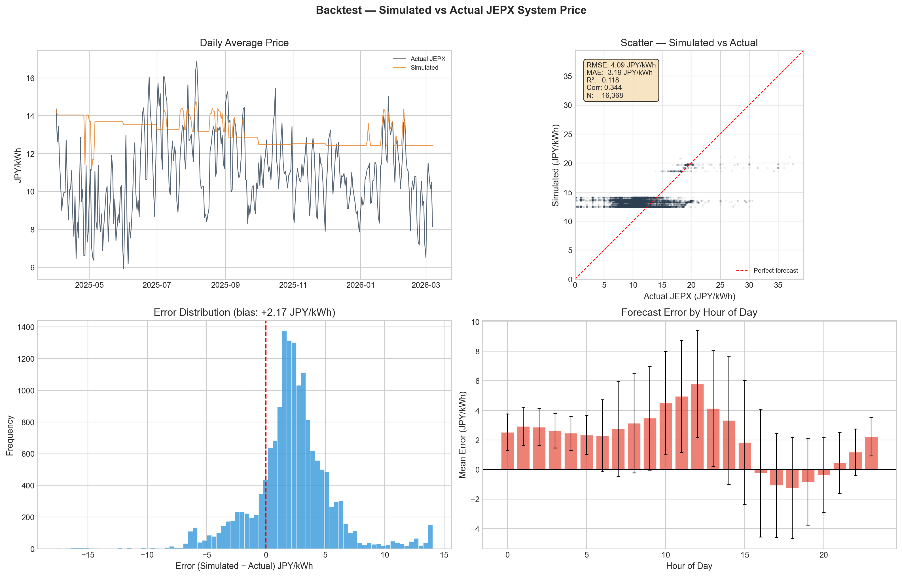

# Japan Electricity Dispatch Economics

A Python-based production cost model simulating half-hourly electricity dispatch across Japan's generation fleet, with scenario analysis focused on the duck-curve dynamics created by rising solar penetration and seasonal demand bimodality.

## Research Question

> In Japan's dual-peak demand structure (summer cooling + winter heating) with accelerating solar PV deployment, how do the dispatch economics and capacity utilization of different generator types shift across seasons and time-of-day — and what happens under nuclear restart and fuel price shock scenarios?

## Method

The model implements two dispatch engine levels:

- **Level 1 — Simple merit-order dispatch**: Each 30-minute interval solved independently. Marginal cost = `fuel_price × heat_rate + variable_O&M + carbon_cost`. Renewables dispatch as must-take, nuclear as must-run, residual demand filled by thermal/hydro in merit order.
- **Level 2 — MILP unit commitment (PuLP)**: Optimises over a multi-day window with startup costs, minimum stable generation, minimum up/down times, and ramp rate constraints. Captures inter-temporal commitment decisions that Level 1 ignores.

### Modeling Assumptions

| Assumption | Value | Rationale |
|---|---|---|
| Spatial model | Single national node (copper plate) | MVP simplification; ignores inter-regional transmission |
| Temporal granularity | 30-minute intervals | Matches raw data resolution |
| Fleet aggregation | By fuel type (10 categories) | Coal split into USC (24 GW) and subcritical (21 GW) |
| Carbon price | 3,000 JPY/tCO₂ | GX-ETS FY2026 mid-range |
| Backtest target | System price (システムプライス) | National clearing price |
| USD/JPY | 150 (fixed) | Approximate FY2025 average |
| Solar installed | 80,000 MW | METI reference |
| Wind installed | 5,000 MW | METI reference |
| LNG CCGT must-run floor | 8,000 MW | Take-or-pay contract obligation |

## Data Sources

All data are publicly available.

| Data | Source | Granularity |
|---|---|---|
| Spot electricity prices | [JEPX](https://www.jepx.org/) | 30-min |
| National demand + generation mix | [JREF](https://www.renewable-ei.org/) (via OCCTO) | 30-min |
| Tokyo area supply-demand | OCCTO ERIA data | 30-min |
| LNG / Coal / Oil prices | [World Bank Pink Sheet](https://www.worldbank.org/en/research/commodity-markets) | Monthly |
| Generator technical parameters | NREL ATB, IEA WEO, Lazard LCOE | Literature-based |

Analysis period: **FY2025** (April 2025 – March 2026).

## Key Results (Base Case)

### Merit Order Curve



### Duck Curve



### Generation Mix (805 TWh total)

| Fuel | Generation (TWh) | Share | Capacity (GW) | Capacity Factor |
|---|---|---|---|---|
| LNG CCGT | 205.9 | 25.6% | 65 | 38.7% |
| Coal USC | 172.1 | 21.4% | 24 | 87.6% |
| Coal Old | 131.7 | 16.4% | 21 | 76.7% |
| Solar | 91.3 | 11.3% | 80 | 14.0% |
| Hydro | 79.1 | 9.8% | 10 | 96.6% |
| Nuclear | 75.9 | 9.4% | 10 | 92.7% |
| Biomass | 35.9 | 4.5% | 5 | 87.7% |
| Wind | 12.2 | 1.5% | 5 | 29.7% |
| LNG OCGT | 1.0 | 0.1% | 15 | 0.8% |

LNG CCGT is the **marginal fuel in 97.4%** of all intervals, setting the clearing price in nearly every period.

### Simulated Clearing Price

| Metric | Value |
|---|---|
| Mean | 13.10 JPY/kWh |
| Std dev | 1.25 JPY/kWh |
| Min | 0.00 JPY/kWh |
| Max | 21.08 JPY/kWh |

### Dispatch Stack



### Seasonal Price Heatmap



### Marginal Fuel Heatmap



### Price Duration Curve



## Level 1 vs Level 2 Dispatch: The Commitment Effect

| Metric | L1 Merit Order | L2 UC (168h) |
|---|---|---|
| Coal share | 33.3% | 42.0% |
| LNG share | 28.2% | 16.7% |
| Avg price | 14.08 JPY/kWh | 15.05 JPY/kWh |

UC raises coal share by **8.7pp** because coal's high startup cost (cold: $100–120/MW) and 24h minimum up-time make it economically rational to commit coal as baseload even during off-peak hours. LNG CCGT, with lower startup costs ($60/MW) and 4h minimum up-time, becomes the system's **cycling unit**.

Merit-order dispatch understates coal baseload commitment. When startup costs and minimum up-times are internalized (Level 2 UC), coal locks in as baseload and LNG shifts to a cycling role — consistent with observed bidding behavior in JEPX. The 8.7pp coal share divergence between L1 and L2 quantifies the **commitment effect**.

Japan's actual coal share (~30–32%) sits between L1 and L2, reflecting a bid-based market with strategic markup behavior that neither pure model fully captures.

**Implication for LNG trading:** This result directly relates to LNG's peaking value and contract structure. The UC model shows that LNG CCGT's economic role is **flexibility provision**, not baseload energy. This supports short-term flexible LNG contracts over rigid take-or-pay structures in a market where coal provides the baseload anchor.

## Scenario Analysis



| Scenario | Avg Price (JPY/kWh) | Δ Price | Key Impact |
|---|---|---|---|
| **Base** | 13.10 | — | LNG CCGT marginal 97% of hours |
| **Nuclear restart** (25 GW) | 12.88 | -1.7% | LNG CCGT gen -85 TWh; nuclear displaces gas |
| **LNG price shock** (×1.5) | 18.73 | +43.0% | Coal_old gains +72 TWh; oil activates |
| **Solar doubling** (160 GW) | 12.32 | -6.0% | Curtailment 8.4 TWh; +912 low-price hours |

### Key Scenario Insights

- **Nuclear restart** compresses LNG utilisation by 41% but barely moves coal — nuclear displaces the marginal fuel (LNG), not the infra-marginal fuel (coal).
- **LNG price shock** triggers a coal↔LNG fuel switch: coal_old generation increases by 72 TWh as the merit order flips. Oil re-enters the stack as emergency peaker.
- **Solar doubling** creates 8.4 TWh of curtailment and pushes 944 hours below the low-price threshold, deepening the duck curve and stranding thermal peakers.

## Backtest vs JEPX Actuals

| Metric | Value |
|---|---|
| RMSE | 4.15 JPY/kWh |
| MAE | 3.28 JPY/kWh |
| Correlation | 0.464 |
| Bias | +2.53 JPY/kWh (overestimate) |



The model captures the broad price level and diurnal pattern but systematically overestimates prices. Key deviation sources:

- **Strategic bidding** — JEPX is a bid-based market; marginal-cost dispatch ignores markup behaviour and infra-marginal bidding strategies
- **Transmission constraints** — Regional price separation (area prices ≠ system price) is not modelled
- **Storage & demand response** — Pumped hydro and battery arbitrage compress peak-off-peak spreads
- **Renewable forecast error** — Actual curtailment and forecast deviations are not captured
- **Hydro dispatch** — Modelled as baseload, but real hydro is dispatchable with reservoir constraints

## Project Structure

```
Japan Electric Market/
├── main.py                      # Pipeline entry point (CLI)
├── config/
│   └── settings.yaml            # Modeling decisions & parameters
├── data/
│   ├── raw/                     # Original source files
│   │   ├── assumptions.yml      # Fleet technical & economic assumptions
│   │   ├── spot_summary_2025.csv
│   │   ├── download.csv
│   │   ├── eria_jukyu_*_03.csv
│   │   ├── CMO-Historical-Data-Monthly.xlsx
│   │   └── DATA_MANIFEST.md
│   ├── processed/               # Cleaned model inputs
│   │   ├── jepx_prices.csv
│   │   ├── demand_profile.csv
│   │   ├── renewable_profiles.csv
│   │   ├── fuel_prices.csv
│   │   ├── fuel_prices_monthly.csv
│   │   └── fleet.csv
│   └── process_raw.py           # Raw → processed ETL
├── engine/                      # Dispatch engines
│   ├── merit_order.py           # Marginal cost & merit-order builder
│   ├── dispatch_solver.py       # Level 1 simple dispatch
│   ├── uc_solver.py             # Level 2 MILP unit commitment (PuLP)
│   ├── startup_cost.py          # Startup cost logic
│   └── clearing_price.py        # Price floor/cap logic
├── scenarios/                   # Scenario engine
│   ├── config.py                # ScenarioConfig definitions
│   ├── runner.py                # Batch scenario execution
│   └── comparator.py            # Cross-scenario comparison
├── visualization/               # Chart generation
│   ├── merit_order_chart.py
│   ├── duck_curve.py
│   ├── seasonal_heatmap.py
│   ├── dispatch_stack.py
│   ├── price_duration.py
│   ├── scenario_comparison.py
│   ├── backtest_chart.py
│   └── style.py                 # Unified fuel colors & theme
├── backtest/                    # JEPX validation
│   ├── price_comparison.py
│   ├── metrics.py
│   └── deviation_analysis.py
├── output/
│   ├── results/                 # Dispatch & price CSVs
│   └── charts/                  # Generated figures (8 charts)
└── requirements.txt
```

## How to Run

### Prerequisites

- Python 3.11+
- Dependencies: `pip install -r requirements.txt`

### Process raw data

```bash
python -X utf8 data/process_raw.py
```

### Run the full pipeline

```bash
python main.py                    # full pipeline (L1 dispatch + UC + scenarios + charts + backtest)
python main.py --no-uc            # skip Level 2 UC (faster)
python main.py --steps dispatch   # load + dispatch only
python main.py --uc-hours 24      # UC window size (default: 168h)
```

## Model Limitations

1. **Copper plate** — No transmission network; cannot reproduce regional price divergence
2. **Fleet-level aggregation** — Individual plant outages and bid strategies not modelled
3. **Hydro as baseload** — Real hydro is reservoir-constrained and dispatchable
4. **No storage** — Pumped hydro and battery storage are excluded
5. **Fuel price granularity** — Monthly prices mapped to half-hourly; no intra-month volatility
6. **UC window** — Unit commitment runs on representative windows (24–168h), not full year

## Future Extensions

- **Multi-region dispatch** — Regional nodes with interconnector capacity constraints (toward PLEXOS-style zonal model)
- **Plant-level unit commitment** — Disaggregate fleet-level to individual plants for realistic commitment
- **Battery storage** — Utility-scale storage charging at solar noon, discharging at evening peak
- **Capacity market** — Model Japan's planned capacity market; analyse peaker fixed-cost recovery
- **Demand response** — Price-responsive demand reducing during high-price hours

## License

This project is an analytical portfolio piece for educational and demonstration purposes. Raw data sources retain their original licenses.
